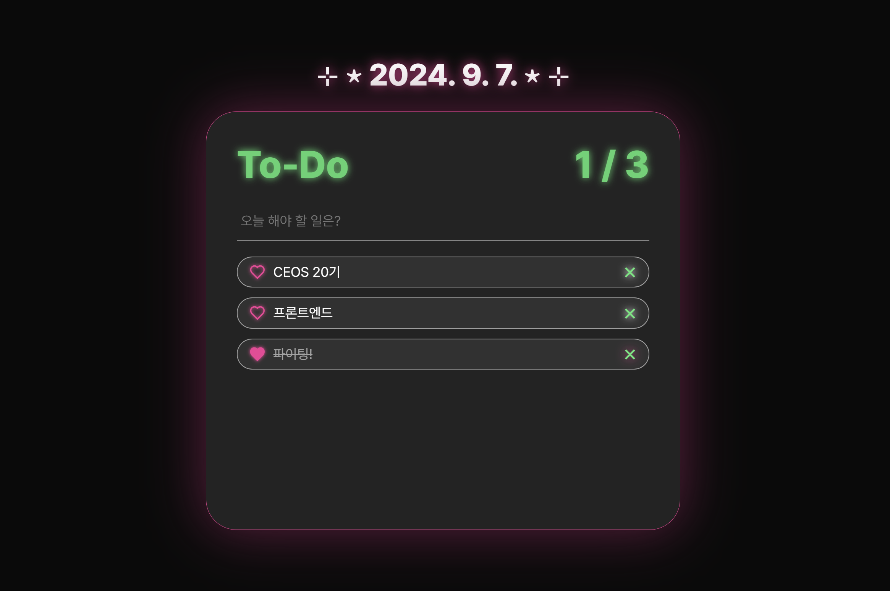

# 1주차 미션: Vanilla-Todo

 

## 🪄 결과물
[🔗 배포 링크](vanilla-todo-20th-ys.vercel.app)

### 🩵 구현 기능
- 할 일 추가, 완료, 삭제 기능

- 날짜 표시 및 오늘의 투두리스트 불러오기

- 완료로 토글 시 해당 항목은 밑으로 배치

- '완료된 항목 수 / 전체 항목 수' 표시

- 로컬 스토리지에 투두리스트 저장

- 디자인: 반응형, 폰트, 애니메이션, 커스텀 커서, hover 및 focus 시의 스타일 추가

### 🩵 느낀 점
바닐라 JS를 한 달 정도 배우고 난 뒤로는 사용헤 본 적이 많지 않아서 이번 과제 초반에 애를 좀 먹었던 것 같다. 리액트의 방식에 익숙해져 있다가 JS만으로 개발을 하려니 꽤 불편했다. **<em>(리액트의 소중함을 깨닫게 되는 순간!)</em>** 또 라이브러리 사용에 제약이 있다 보니 작은 거 하나 추가로 구현하려고 해도 써야되는 코드들이 많아 너무 비효율적으로 느껴졌다. 원하는 기능을 다 넣으려면 정말 코드가 중구난방으로 길어질 것 같았다. 누군가는 코드리뷰로 내 걸 다 읽으셔야 하니... 최대한 필수 기능을 중심적으로, 간결하고 효율적인 코드를 적기 위해 노력했다. (잘 했는지는 모르겠지만...) 그래도 이번 과제를 통해 기본기를 탄탄하게 다질 수 있어서 좋았고, 복습을 열심히 해야겠다는 다짐을 하게 되었다.

 

## 💡Key Questions

### 1️⃣ DOM은 무엇인가요?

Document Object Model의 약자로, 웹사이트를 구성하는 요소이다. DOM은 웹페이지의 모든 구성 요소를 하나의 트리 구조로 표현하는데, 이 트리는 각각의 요소들을 Node(노드)라고 부르고, 이 노드들은 서로 부모-자식 관계를 맺고 있다. 내가 이번에 작성한 index 파일을 예로 들면, `<html>`안에 `<head>`, `<body>`와 같은 큰 줄기가 있고, 그 안에 `
`, `<form>`, `<ul>` 같은 가지들이 있으며 또 그 안에 `<h2>`, `<input>`, `<li>`와 같은 더 작은 요소들이 존재한다. 개발자는 프로그래밍 언어를 통해 이 구조에 접근하고 수정할 수 있게 된다.

DOM은 웹페이지의 내용이나 구조를 동적으로 수정할 수 있다는 점, 문서의 구조를 명확하게 정의할 수 있다는 점, 접근성 측면에서 유리하다는 점 등의 장점을 가지고 있지만, 단점도 존재한다. 우선 DOM 트리를 처리할 때 성능이 저하될 수 있다는 문제가 있다. 만약 DOM의 트리 구조가 매우 크고 복잡하다면, DOM을 탐색하고 수정하는 과정에서 성능에 큰 부담이 될 수 있다. 또한 모든 브라우저가 DOM을 동일하게 처리하지 않을 수도 있다는 점 또한 고려해야 한다. 간혹 오래된 브라우저에서는 일부 DOM 메서드가 동작하지 않을 수 있다. (이 경우, 폴리필을 사용하거나 트랜스파일러를 사용해서 해결할 수는 있다.)

### 2️⃣ 이벤트 흐름 제어(캡처링 & 버블링)이 무엇인가요?

클릭, 스크롤, 입력 등과 같은 웹페이지에서 실행되는 사용자의 행동을 이벤트라고 부른다. 이러한 이벤트가 발생했을 때, 해당 이벤트가 웹페이지에서 어떻게 전달되는 지에 관한 것이 바로 이벤트 흐름제어이다. 이벤트 흐름 제어는 이벤트 캡처링과 이벤트 버블링으로 나뉘어지며, 개발자가 이벤트가 발생했을 때 어느 단계에서 이벤트를 처리할 것인지를 결정하는 데 중요한 역할을 한다. 

- **이벤트 캡처링**: 위에서 아래로 이벤트가 전달되는 과정이다. 즉, 사용자가 클릭한 요소에 이벤트가 도달하기 전에 그 요소의 부모 요소들부터 먼저 이벤트를 전달받는다. 예를 들어, 내가 어떤 `
` 요소를 클릭했을 때, 그 요소가 트리 구조의 하위에 속해 있어 `
` 안에 있고, 그 `
` 가 `<body>` 안에 있다면, 결국 이벤트는 트리의 최상위 요소인 `<html>` 에서 `<body>` , `
` , `
` 로 내려가며 전달된다. 이 흐름을 캡처링 단계라고 한다.

  캡처링이 이루어지고 난 뒤에는 이벤트가 해당 요소에서 처리되는 단계를 거친다. 이 때 이벤트는 어딘가로 전달되지 않고 사용자가 실제로 행동한 그 요소에서만 실행된다. 즉, 이벤트가 처리되는 최종 단계라고 할 수 있으며 이 때 해당 요소에 등록된 모든 이벤트 리스너가 실행된다. 만약 캡처링 단계에서 이벤트를 처리해야 할 일이 발생한다면, 이벤트 리스너를 활용할 수 있다. `addEventListener()` 메서드를 통해 리스너를 등록하고,  세번째 인자로 true값을 넘겨주면 해당 리스너는 캡처링 단계에서 이벤트를 처리하게 된다.
  
- **이벤트 버블링**: 캡처링과는 반대로 아래에서 위로 이벤트가 전달되는 과정이다. 이벤트가 목표 단계에서 처리된 후, 해당 이벤트가 다시 부모 요소로 전달되는 것이다. 기본적으로 자바스크립트는 버블링 방식을 따르고 있으나, 때로는 이벤트가 부모 요소로 전달되는 것을 막아야 할 때가 있다. 그럴 때는 `stopPropagation()` 메서드를 통해 중지시킬 수 있다.

### 3️⃣ 클로저와 스코프가 무엇인가요?
- **클로저**: 함수가 선언된 환경을 기억하는 함수를 의미한다. 즉, 클로저는 함수 자신이 만들어졌을 때의 외부 변수를 기억하고, 그 변수를 이후에도 계속 사용할 수 있게 해준다. (A 함수 안에 있는 B 함수는 A함수가 종료된 후에도 A 안에서 선언되었던 변수에 접근할 수 있다는 의미) 클로저는 함수 호출 시마다 동일한 변수를 사용할 수 있어 동작을 효율적으로 관리할 수 있다는 장점이 있지만, 클로저가 여러번 중첩되면 어느 변수가 어디서 온 건지 추적하기 어려워지기 때문에 디버깅이 어려울 수 있다는 단점이 있다.

- **스코프**: 변수가 유효한 범위를 의미한다. 자바스크립트에서는 변수가 선언된 위치에 따라 그 변수를 사용할 수 있는 범위가 결정되는데, 이를 크게 전역 스코프와 지역 스코프로 나눌 수 있다.
  - **전역 스코프**: 전역 스코프에 선언된 변수는 모든 페이지에서 접근할 수 있다.
  - **지역 스코프**: 지역 스코프는 함수나 블록 내에서 선언된 변수이기 때문에 해당 블록 안에서만 유효하고, 블록 밖에서는 접근할 수 없다.